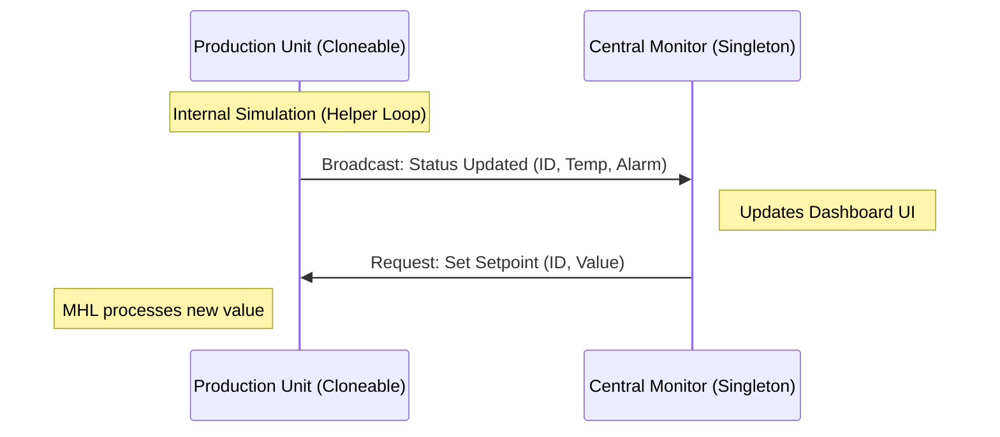

# Virtual Factory DQMH Demo
  
  

A professional demonstration of a **Distributed Control System** using the Delacor Queued Message Handler.

## 🏗️ Architecture
This project follows a modular approach:
- **Central Monitor (Singleton):** Aggregates data and manages the UI.
- **Production Unit (Cloneable):** Simulates independent machinery.

## ⚖️ Standards
- **Development Process:** We follow a strict [Definition of Done](./docs/definitions/definition_of_done.md) for every module and feature.
- **Decision Tracking:** Architectural changes are documented via [ADRs](./docs/adr).

## 📂 Project Structure
Visualizing the repository layout and module hierarchy
```text
/Virtual-Factory-DQMH
│
├── /docs
│   ├── requirements-specification.md       # Funktionales Lastenheft (Anforderungen)
│   ├── /adr                                # Architecture Decision Records
│   │   ├── 0001-choice-of-frameworks.md
│   │   ├── 0002-communication-pattern.md
│   │   └── ...
│   └── /img                                # Screenshots of UIs and diagrams
│
├── /src                                    # The LabVIEW-Code
│   ├── /Libraries                          # Common classes and typedefs
│   ├── /Modules                            # The DQMH-Modules (.lvlib)
│   │   ├── /CentralMonitor                 # Singleton
│   │   └── /ProductionUnit                 # Cloneable
│   └── Main.vi                             # Top-Level VI (Application Launcher)
│
├── /tests                                  # Unit-Tests & API-Tester documentation
│
├── README.md                               # Project oversight & setup instructions
└── .gitignore                              # LabVIEW optimized ignore settings
```

## 🔌 System Communication
This diagram explains how the Singleton (Monitor) and Cloneables (Units) interact without being tightly coupled.


## 🚀 Key Features
- Dynamic module cloning.
- Decoupled communication via Broadcasts.
- Automated sensor data simulation.